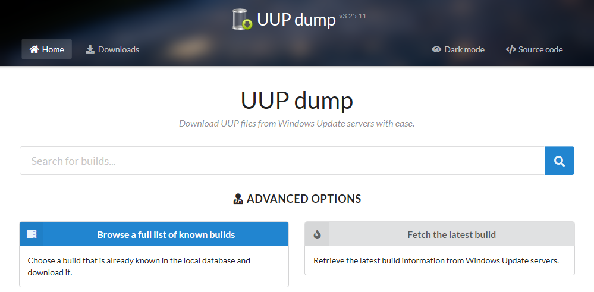
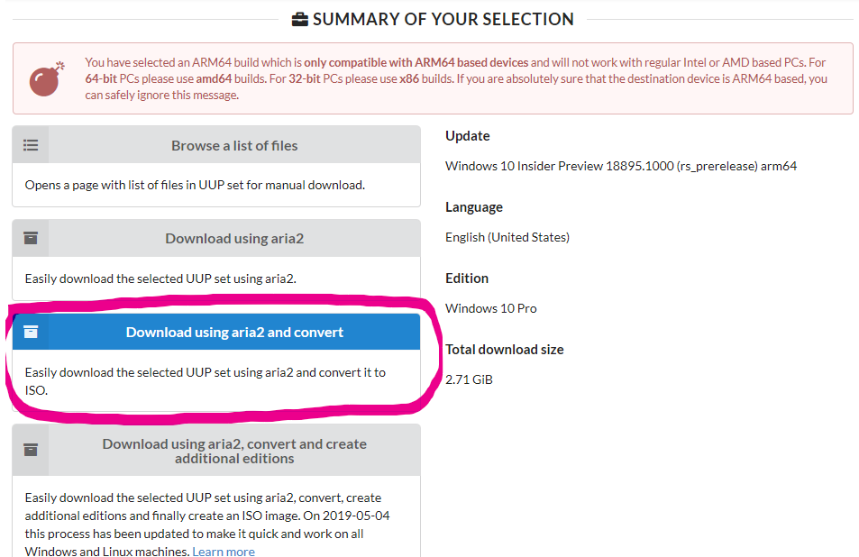

# Getting Windows 10 ARM
1. Go to this site: https://uupdump.net/

 

1. Click on **Browse a full list of known builds**. 
1. Select a build. It's usually fine to choose the latest insider build
	* Please, notice you have to select a build that is for the **ARM64** architecture (not to confuse with AMD64). These are the ones that end in "arm64"	 
1. After you've selected all the options (language and edition) you need to **Download using aria2 and convert** 

1. Your browser will download a .zip file. Save it or open it directly.
1. Extract the .zip file to a new empty folder, preferably one that doesn't contain spaces in the path, like "c:\temp\W10IsoScripts"
1. Execute the script **aria2_download_windows.cmd** and wait for it to complete.
1. When the script has finished, you will find a **.iso** inside, as a result of the process.
1. Mount the .iso file with Windows Explorer by double clicking it.
1. Navigate to the folder x:\sources, where **x:** is the drive letter of the mounted .iso file.
1. Inside this "sources" folder you will find the **install.wim** that WoA Installer needs to deploy Windows
1. Put the phone into Mass Storage Mode with WPInternals
1. Go back to WOA Deployer, select the .wim file
1. Deploy and rejoice 😃!
