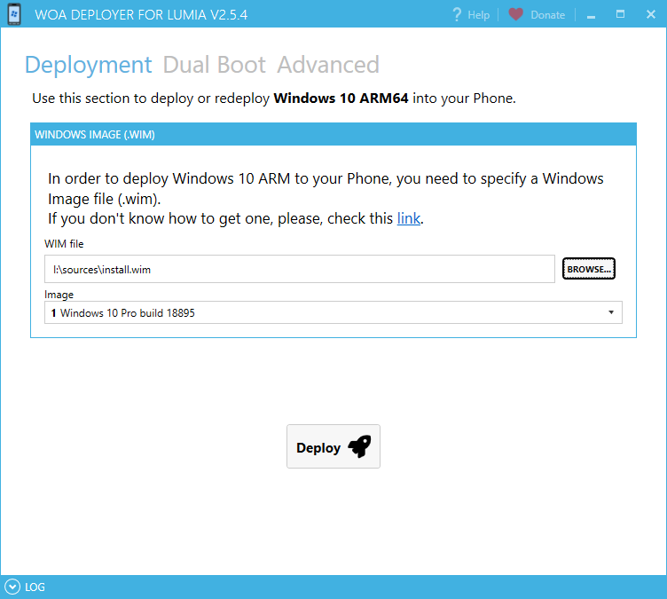

# WOA Deployer for Lumia
The application to install Full Windows 10 into your phone!

 
Did you know that Lumia 950 Series run Windows 10 ARM quite well? (**specially the XL**). Now you can install it in a few clicks with **WoA Installer**. 

# **Super easy to use. No-hassle.**

Please keep reading carefully. All you need is here.

# Requirements
- A Lumia 950 or 950 XL with **unlocked bootloader** that can correctly enter *Mass Storage Mode*
	- You can unlock the bootloader using this tool: [WPInternals](http://www.wpinternals.net). You can follow [this guide](https://1drv.ms/w/s!AtXoQFW327DIyd4XabdpcztOVGGANA).
- A USB-C cable to connect the Lumia to your PC
- A Windows 10 ARM64 Image (.wim). Please, check [this link](Docs/GettingWoA.md) to get it.

## It allows Dual Booting Windows 10 Mobile
You don't have to ditch Windows 10 Phone 😃 You can **keep it!**! Using this tool, you can enable Dual Boot in literally 2 clicks. Please, check [this video](https://www.youtube.com/watch?v=3j2rWL4hHGc) to see a demonstration of the feature.

# How do I use it?

Please, watch this video tutorial make by our friends at [WindowsArea.de](https://windowsarea.de/)

📺 [Watch it here](https://www.youtube.com/watch?v=FkE9SJOgGLM)

# Download it!

Download the latest version [here](https://github.com/WOA-project/WOA-Deployer/releases/latest)

# Show the love ♥

Do you like my tool? Has it been useful for you?
Then, I hope you [support my work](Docs/Donations)